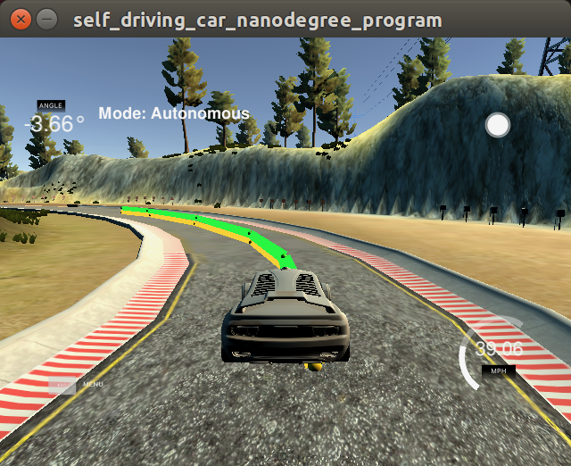
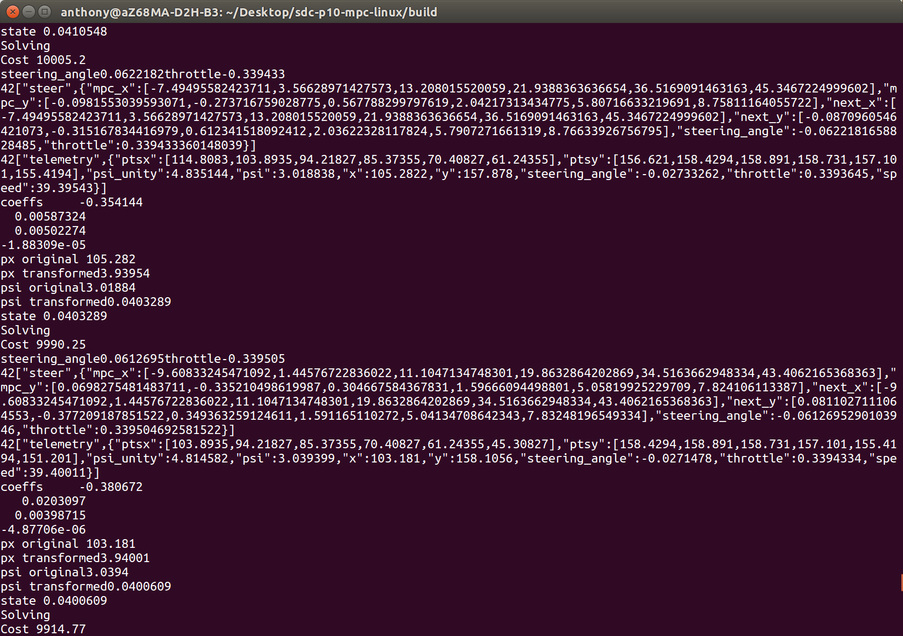
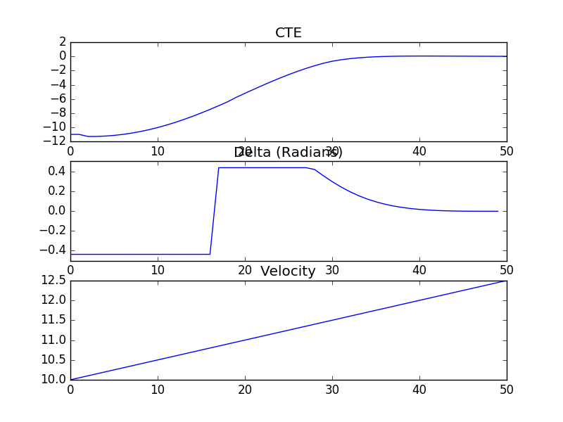
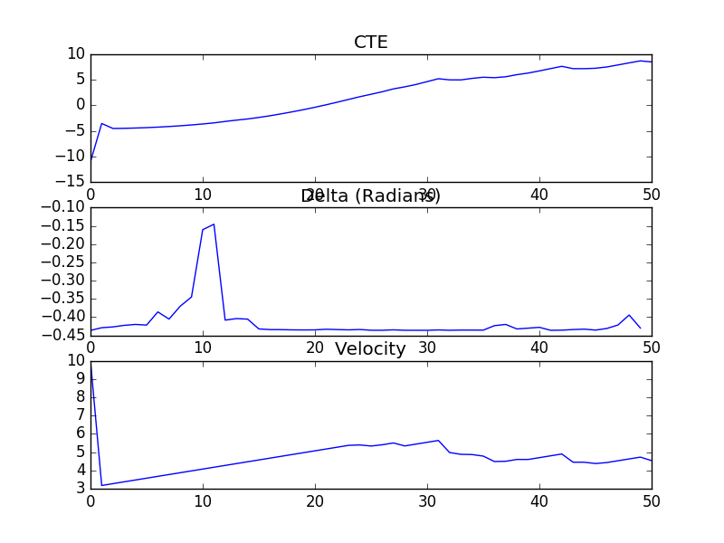

# Model predictive control (MPC)




#### A MPC optimizes the current controls while keeping future information in mind.


## Overview

While driving we aim to stay in a lane, keep to a speed, and turn smoothly.
To do this we look ahead. For example, if a sharp turn is coming we will slow down in advance.
If we see we have reached the middle of a curve, we will start to reverse the steering wheel.

For a self driving car this challenging. Let's say for example that our perception and localization systems have identified a path we wish to follow. Great! Now we simply look at how far we are from the path right? If we are far from the path we set a higher steering angle, and if we are 
close to the path we set a lower steering angle. Easy, just set it in proportion right?

Slight problem, doing this means we will always overshoot the path. Ok, so we add in some function (say a derivative) to make it more graceful, and maybe even something to counter drifts over time (integral). Perfect. Now we have a PID controller. 

Now I'll just take my car onto the highway and go straight for a while... or not! The PID controller keeps overshooting! That's no good.

Hmm how about I take this side street with a few sharp corners then... hmmm seems to be having trouble! uh oh... now it's raining! I hope this PID controller accounts for the rain! Snow, ice, mud? Maybe we need something else.

#### Model predictive control to the rescue! :)
A MPC controller can keep a perfectly straight line, solving our constant overshooting problem. Great! And it even looks into the near future to predict outcomes, similar to the way we look ahead when we drive. Perfect! Plus it can even account for an arbitrarily complex environment, including allowing for things like snow and ice.

The primary trade-off is that a MPC adds more complexity.

#### Ok how does it work? 

MPCs are complicated! This has been one of the more complex projects of the nanodegree so far. There is a lot going on in the code in main.cpp and MPC.cpp, and that's not even included the small mountain of libraries we are using.

It makes sense this is complicated, real life MPCs do some serious work including critical control functions for nuclear power plants -- so this is some tough stuff.

Below is a fairly verbose walk through designed for someone interested in getting a basic intuition of the technical detail and the specifics of this implementation. It's focused on the engineering and programming side.


## The model

A MPC has a model that includes costs for dynamics you wish to consider. 
When we use the MPC we optimize the total cost to 0.

Our MPC has two key steps
1. Evaluation
2. Solve

### 1. Evaluation

Here we define costs and our model.

#### 1.1 Costs

We define costs as a numerical value where higher costs are worse than lower costs.
For example if our car is going at 20 mph and the goal is 40 mph the cost for being at the reduced speed should be > 0. (ie "2.0"). Then as we get closer to 40 mph that cost will be reduced. Let's go to the code:

We start with `fg[0] = cost = 0`

Then we add in costs for reference (target) state:
```
for (int t = 0;   t < N;  t++) {
  fg[0] += CppAD::pow( vars[cte_start + t]   - ref_cte,  2) ;
}
```
Here, `N` is the number of time steps we are forecasting. Essentially how far into the future we are looking.

We are comparing the current cte (cross track error) to our reference. Since we want our car to go straight, our reference CTE is 0. For our target speed, we set `ref_v` to a speed, ie 64 (mph).

Adding another cost is easy, we add it to the same running sum.

```
for (int t = 0;   t < N;  t++) {
  fg[0] += CppAD::pow( vars[cte_start + t]   - ref_cte,  2) ;
  fg[0] += CppAD::pow( vars[v_start + t]     - ref_v,  2) ;
}
```
This however presents a slight challenge, what if we care more about the cte than we do about velocity?
Hyperparameters to the rescue! 

By adding a multiplier ie `coeff_cost_ref_cte = 32` to our cost function we are able to control how much each concept effects our system.

```
for (int t = 0;   t < N;  t++) {
  fg[0] += coeff_cost_ref_cte   * CppAD::pow( vars[cte_start + t]   - ref_cte,  2) ;
  fg[0] += coeff_cost_ref_epsi  * CppAD::pow( vars[epsi_start + t]  - ref_epsi,  2) ;
}
```
See the full function line 77 in MPC.cpp


#### 1.2 Kinematic model

Great now that we have costs, let's specify our model.
Again we will do this for each timestep `N`

```
for (int i = 0; i < N - 1; i++) {
  AD<double> x_t1     = vars[x_start    + i + 1] ;
  AD<double> x_t0     = vars[x_start    + i] ;
  // ... further states
}
```
In this model we define 
```
x = x position
y = y position
psi = angle
cte = cross track error
e_psi = error of angle
delta = steering target
a = acceleration / throttle target
```
Then we define for a given time step
` fg[2 + x_start + i]    = x_t1   - (x_t0 + v_t0 * CppAD::cos(psi_t0) * dt ) ; `

Here we introduce `dt = delta time = (ie) .016`.
This is the frequency to which we are looking into the future.
So for example if we set `N = 16` and `dt = .016`, we are looking `N * dt = 16 * .016 = .256` time steps into the future.

Here `x prime` = x_t1` - `x_t+1`.
We are using Udacity's suggested model of x​t+1​​=x​t​​+v​t​​∗cos(ψ​t​​)∗dt
This models allows for our velocity, angle (psi), and timestep*(dt) for which we are predicting.

After we repeat this for y, psi, v, cte, and epsi using the following models provided by Udacity:

```
y​t + 1​​ = y​t​​ + v​t​​ * sin(ψ​t​​) * dt

ψ​t + 1​​ = ψ​t​​ +​ L​f​​​​ * v *​ t ​​​​* δ * dt

v​t + 1​​ = v​t​​ + a​ * t​​ ∗ dt

cte​t + 1​​ = f(x​t​​) − y​t​​ + (v​t​​∗sin(eψ​t​​)∗dt)

eψ​t+1​​ = ψ​t​​ − ψdes​t​​ + (​L​f​​​​ * v *​ t * δ​t​​ * dt)
```


---

### 2. Solve

Our solve function takes a state and coeffs and returns the results of the COIN-OP solve().
The coeffs are of a polynomial fitted line and the state represent things like x, y, and velocity.


#### 2.1 Coeffs

`coeffs = polyfit(x_car_space, y_car_space, 3) ;`

In order to get x_car_space to make sense we must first transform the coordinates from map coordinates to car coordinates. 

In car coordinates x is positive dead ahead, and y is positive to the left of x.
In map ordinates x is positive to the right and y is positive going up (like a normal graph).

```
Eigen::VectorXd   x_car_space = Eigen::VectorXd( ptsx.size() ) ;
for (int i = 0;   i < ptsx.size() ;   i++) {
  x_car_space(i) = (ptsx[i] - px) * cos(psi) + (ptsy[i] - py) * sin(psi)  ;
}
```


#### 2.2 State vector

The state vector is defined in main.cpp main() line 153 `state << px, y, psi, v, cte, epsi ;`
and unpacked in MPC.cpp Solve()

We pass the coeffs of the fitted line to our evaluation functions,
and the 2nd coeffs to our arc tangent function to calculate our angle error.
```
cte  = polyeval(coeffs, px) ;
epsi = atan( coeffs[1] ) ;
```


#### 2.3 Latency
Now we introduce the concept of latency. Later in our process we purposely do:
`this_thread::sleep_for(chrono::milliseconds(100));`

The latency is introduced to mimic real world driving, where actuators are limited by wire distance, mechanical properties and other variables, and so are unlikely to respond instantaneously.

Circling back to the state vector, we define `px = v * latency ;` where `latency = .1`
to allow for this latency in our predictions.


#### 2.4 Constraints

Now we define actuator constraints (these were provided by Udacity)
```
for (int i = delta_start; i < a_start; i++) {
  vars_lowerbound[i] = -0.436332; // in radians , represents 25 degrees
  vars_upperbound[i] =  0.436332;
}
```
These constraints are required for the COIN-Op function reach reasonable values.


Now we perform the earlier discussed eval() function passing our coefficients.
`FG_eval fg_eval(coeffs);`
which updates our model and costs.
Stated another way, the costs represent our objective since our objective is to minimize our total cost.


#### 2.5 Solve()
Now using COIN-OP Solve we can get the mathematical result of the problem we have
spent most of the program framing.
```
  CppAD::ipopt::solve<Dvector, FG_eval>( options, vars, vars_lowerbound, 
                                         vars_upperbound, constraints_lowerbound,
                                         constraints_upperbound, fg_eval, solution);
```

As the focus of the MPC is the model, constraints, processing, hyperparameters, and input/output for the project, we treated this function as a magic blackbox. As discussed below in more detail I'm curious to learn more about this.

We store the result of this function in a vector thats returned.
For use by Solve() we have been somewhat cumbersomely storing all variables in a vector with defined indexes. To simplify this for the key `steering_angle (delta)` and `throttle (a)` values we store the values in a class variable which is retrieved in main.cpp.

This returned result is the end of MPC()s work for one cycle.


### General processing pipeline

Moving on we review the general processing pipeline.

Steps 6 is the key step that kicks off the above described MPC process.

1. Initialize mpc class
2. Collect data from simulator
3. Convert map space to car space
4. Fit line to get coefficients
5. Error calculation (Cross track and Psi) and state definition.
6. Solve KEY STEP 
7. Pass output to simulator
8. Predicted line visual for simulator
9. Way point visual for simulator
10.Add latency to mimic real world driving conditions


Example output from console



### Comparison to PID controller

While touched on above here we get a bit more specific:

* Better integration of speed and steering angle. While you can use two different PID controllers (ie one for speed and one for steering), they don't directly interact with each other. You can use a heuristic, such as at higher speeds `steering = steering_PID / ~speed_or_something`, but this is not the same as having both concepts directly integrated together.

* Better performance going straight. A PID controller will never strictly converge, where as a MPC controller can in theory reach 0. This is visible in practice, in the PID project to get good performance on tight corners the model generally needed to wander a bit on straightaways. Where as in the MPC project you can get good performance on corners and straight lines. 

* Smoother performance in the real world. The ability to "look ahead" helps mimic a human driver as discussed above. Further our model can account for arbitrary dynamics including latency. More advanced models could consider tire performance, snow, etc. Related to this is better recovery. While a far off course PID controller sometimes gets a little "lost" the MPC appears to be more robust. I'm guessing this is due to the "look ahead" nature, which more naturally follows the target path, where as the PID controller tries to get back to the "goal of the moment", so as the complexity of the target path increases, the PID can get more and more "lost".


The primary draw back seems to be complexity.

MPC is more complex. It's clearly more complex to setup and I'm guessing it requires more computational resources. Complexity is generally bad in safety critical systems. Complexity also increases development time etc.

---

### Hyperparameters

#### Look ahead

```
N   = 16.;
dt  =  0.016 ;
```

I started with higher values for dt and found lower seemed to perform better.
As discussed above this is looking .256 time steps ahead and we have a latency of .1 time steps.
This seems like a reasonable time frame. I would like to experiment further with larger values here.

These factors can be quite important for convergence for example here is a comparison of two dt values in an earlier quiz:

`dt = .05`


`dt = .10`


#### Target speed

`ref_v = 64;`

The model requires further tuning to go above 64 mph

#### Cost coefficients
```
coeff_cost_ref_cte           = 320;
coeff_cost_ref_epsi          = 64;
coeff_cost_ref_v             = 1;
coeff_cost_ref_val_throttle  = 16;
coeff_cost_ref_val_steering  = 160;
coeff_cost_ref_seq_throttle  = 32;
coeff_cost_ref_seq_steering  = 6400;
```

I started without even using these. Then tried only using the `coeff_cost_ref_seq_steering`.
Generally I found if it was too high, it simply wouldn't turn and too low it would wobble too much.

---

## Further research and opportunities

* Further diving into the theory side of MPCs
* Further tuning of this project.
* Review of Magic functions() like the COIN-OP Solve().
* Deeper understanding of space transformations
* Code refactoring, especially the 3 God size functions. And there has got to be a better way to keep those vector indexes straight even if Solve() does need it in one vector!

## Sources and credits

This is a student project with the primary goal being to learn and understand the concepts behind a model predictive controller.

1. Udacity provided starter code, quiz code, and lessons.
2. Ideas from other students and mentors through forums, chat channel, and github.
3. The various dependency libraries.
4. [Wikipedia](https://en.wikipedia.org/wiki/Model_predictive_control)


---

## Dependencies

* cmake >= 3.5
 * All OSes: [click here for installation instructions](https://cmake.org/install/)
* make >= 4.1
  * Linux: make is installed by default on most Linux distros
  * Mac: [install Xcode command line tools to get make](https://developer.apple.com/xcode/features/)
  * Windows: [Click here for installation instructions](http://gnuwin32.sourceforge.net/packages/make.htm)
* gcc/g++ >= 5.4
  * Linux: gcc / g++ is installed by default on most Linux distros
  * Mac: same deal as make - [install Xcode command line tools]((https://developer.apple.com/xcode/features/)
  * Windows: recommend using [MinGW](http://www.mingw.org/)
* [uWebSockets](https://github.com/uWebSockets/uWebSockets) == 0.14, but the master branch will probably work just fine
  * Follow the instructions in the [uWebSockets README](https://github.com/uWebSockets/uWebSockets/blob/master/README.md) to get setup for your platform. You can download the zip of the appropriate version from the [releases page](https://github.com/uWebSockets/uWebSockets/releases). Here's a link to the [v0.14 zip](https://github.com/uWebSockets/uWebSockets/archive/v0.14.0.zip).
  * If you have MacOS and have [Homebrew](https://brew.sh/) installed you can just run the ./install-mac.sh script to install this.
* [Ipopt](https://projects.coin-or.org/Ipopt)
  * Mac: `brew install ipopt --with-openblas`
  * Linux
    * You will need a version of Ipopt 3.12.1 or higher. The version available through `apt-get` is 3.11.x. If you can get that version to work great but if not there's a script `install_ipopt.sh` that will install Ipopt. You just need to download the source from the Ipopt [releases page](https://www.coin-or.org/download/source/Ipopt/) or the [Github releases](https://github.com/coin-or/Ipopt/releases) page.
    * Then call `install_ipopt.sh` with the source directory as the first argument, ex: `bash install_ipopt.sh Ipopt-3.12.1`. 
  * Windows: TODO. If you can use the Linux subsystem and follow the Linux instructions.
* [CppAD](https://www.coin-or.org/CppAD/)
  * Mac: `brew install cppad`
  * Linux `sudo apt-get install cppad` or equivalent.
  * Windows: TODO. If you can use the Linux subsystem and follow the Linux instructions.
* [Eigen](http://eigen.tuxfamily.org/index.php?title=Main_Page). This is already part of the repo so you shouldn't have to worry about it.
* Simulator. You can download these from the [releases tab](https://github.com/udacity/CarND-MPC-Project/releases).

## Basic Build Instructions


1. Clone this repo.
2. Make a build directory: `mkdir build && cd build`
3. Compile: `cmake .. && make`
4. Run it: `./mpc`.