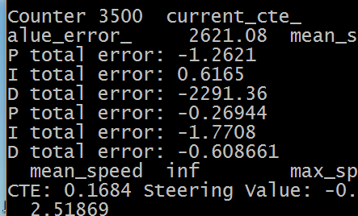
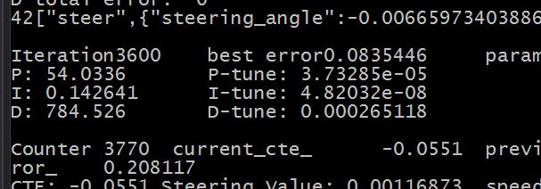
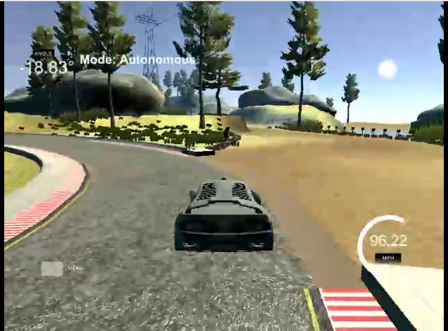

# Reflections

## Error difference (Proportional) P

P is how fast you want the controller to bring the car back into line.
For this project the most challenging corners are near the end of the loop.
I increased P until the car could take that corner.
If the value is too low the car won't be able to take sharp corners. 
If it's too high it will move side to side (oscillate) too much.

## Error sum (Integral) I

I is the sum of the errors over time. For example, if you car's steering is crooked it will drift to one side. I corrects this by noticing small errors that accumulate over a period of time.
If it's too high, it will over correct and oscillate.
If it's too low, it will never reach true center.

## Error rate of change (Derivative) D

D is the smoothy. A larger D value makes the car turn more gradually.
Too large and it won't turn much at all.
Too small and it will keep overshooting it's target.

## Process
1. Set target speed for throttle PID
2. Set reasonable P and D for throttle PID
3. On the steering PID increase P till it can take the hard corners
4. Up D till it stops oscillating
5. Increase I as a final stabilizer, until it reaches center and doesn't overly add oscillation
6. Tweak in small increments as needed

I found it useful to print the PID values of both controllers(
top is throttle, bottom is steering), to get an idea of the actual output.

For example, here I can see all values are firing. D in the throttle PID looks out of whack compared to the other values, indicating a potential issue.

## Observations

### Twiddle
I tried using twiddle then went back to manual tuning. 

For this use case, it appears to require nearly ideal parameters to start with making it's use less relevant.

I suspect one of the issues is the nature of the simulation. Twiddle works great when you can instantly test say 150 iterations, but on a varied test track like this that doesn't appear to be feasable.

One of the hardest simulator turns may not be labeled correctly. The "edge" is different from the other edges, and I have a suspicion that a perfectly optimized system would constantly hit the square block that protrudes from the track.

I'm sure there is something that can be done here and open to ideas.

Here is an example of twiddle results, using pre-tuned paramters to start:

### Importance of speed

I think an unstated but critical element here is speed. 
What appears perfectly fine at say 30 mph may likely fail at 60. I found generally the inverse is not true. For example a controller that works well at 60 will work well at 40 too, although it may be a little too "edgy" to be optimized for that speed.
In further work I would be curious about the interplay between those two systems.

Over time I added mean_speed and max_speed to get a better handle empirically on how the car was performing.

### Don't use the brakes

I tried using the brakes, and also adding conditional statments like a steering booster: "if sharp turn, turn sharper". I found generally these were band-aid solutions and not robust, better to find good parameters for the PID controllers themselves.

## Final hyperparameters

Usage `./pid.exe kp ki kd speed_goal throttle_kp throttle_ki throttle_kd`

## Max sim speed (100 mph)
`./pid.exe 1.60 0.018 76. 100. 9 .3 15`

[Here is a link to the video.](video/100-run.mp4)

I feel this is a pretty solid result as it reaches the simulators maximum speed,
and 95% of the max speed on the toughest corner.

Further in my earlier tests I was only able to get to around 40 mph so this is a significant improvement.

Sometimes it becomes unstable on the 2nd run,
as it has time to build up to a constant 100,
and the limit on the one corner is 95mph.

For example, with similar settings mean_speed of 77.9 mph and max_speed of 100 mph was acheived

A higher average speed can be acheived without additional effort, at the expense of max speed.

## Infinitely stable (91 mph)
`./pid.exe 1.60 0.018 76. 91. 7 .3 15`

I found this appears to be continually stable.

